## Docker 


로컬에서 잘 실행되는 Spring Boot 프로젝트를 Naver Cloud Platform(NCP) 서버에서 실행시켜 보려고 한다.


#### 작업 순서

1. Local에서 Docker에 Container와 Image 만들기
2. DockerHub에 Image push하기
3. 원격 서버에서 Image pull하기<br>


##### Local에서 Docker에 Container와 Image 만들기

---

먼저 프로젝트 내의 설정을 변경해주어야 한다.<br>


- build.gradle 에서 다음과 같은 코드를 추가한다.


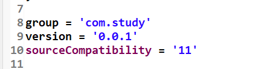


- 프로젝트 바로 아래 Dockerfile을 생성해준다.(이름이 꼭 Dockerfile 이어야 한다.)

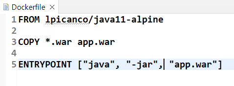


- application.properties 설정을 변경해준다.

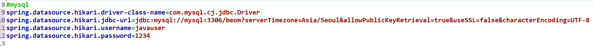

여기서 주의할 점이 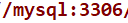

이 부분이다. "mysql" 은 추후에 생성할 mysql docker image의 이름이다. <br>

또, ```useSSL=false&allowPublicKeyRetrieval=true``` 이 부분이 빠진다면 DB 연결 실패 오류가 발생할 것이다.

<br><br>


이제 war 파일을 만들어 주면 된다.

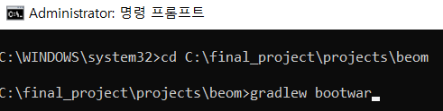


war 파일이 잘 만들어졌는지는 다음과 같이 확인하면 된다.

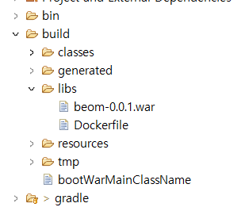

위 사진처럼 만들어놓은 Dockerfile의 위치를 변경한다.

<br><br><br>


[Docker 설치](https://www.docker.com/get-started/) --> DockerHub 계정을 생성하고 Docker Desktop을 OS에 맞게 설치한다.<br>

이제 cmd or windows powershell을 이용해 docker image를 만들 것이다.<br>


```cd build/libs``` : 폴더 위치 이동

```docker login``` : docker 계정과 연결한다.

<br>

```docker network create [이름]``` --> ```docker network ls``` 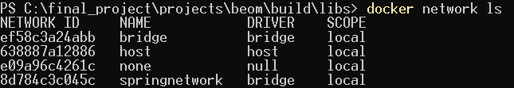

(내가 만든 network는 "springnetwork")

```docker volume create [이름]``` --> ```docker volume ls``` 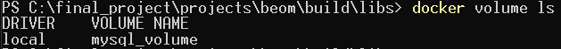


```docker pull mysql ``` : mysql image 생성

```docker run -d --name [mysql container 별명] -e MYSQL_ROOT_PASSWORD=[root 계정 비밀번호] -p 3306:3306 --network [network id] -v [volume name]:/var/lib/mysql mysql``` : mysql container 생성 및 실행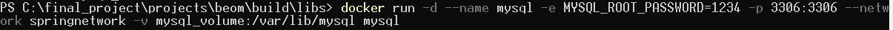


```docker build -t [war파일 이름] .``` : 프로젝트 image 생성 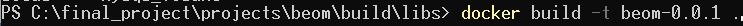

```docker run -it --name [프로젝트 container 별명] --network [network id] -p 8000:8000 [war파일 이름] bash``` : 프로젝트 container 생성 및 실행 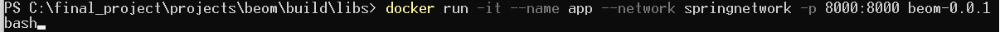

<br><br><br>


##### DockerHub에 Image push하기

---


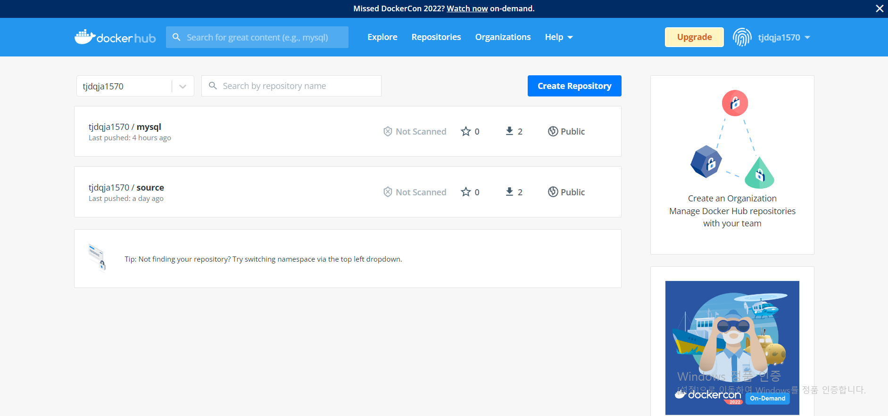

DockerHub에 접속해 다음과 같이 두 개의 repository를 create한다.


```docker tag [이미지 별명] [repository 이름]``` : tag를 이용해 DockerHub로 Push하기 위한 연결과정을 실행한다.

```docker push [repository 이름]``` : DockerHub로 Push한다.


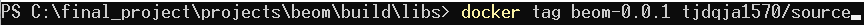

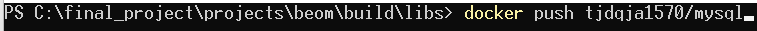


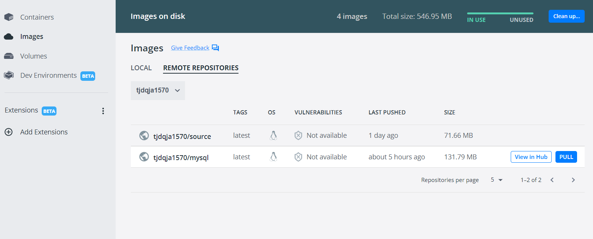

성공적으로 push 됐다면 위 사진처럼 repositories가 보일 것이다.

<br><br><br>


##### 원격 서버에서 Image pull하기

---

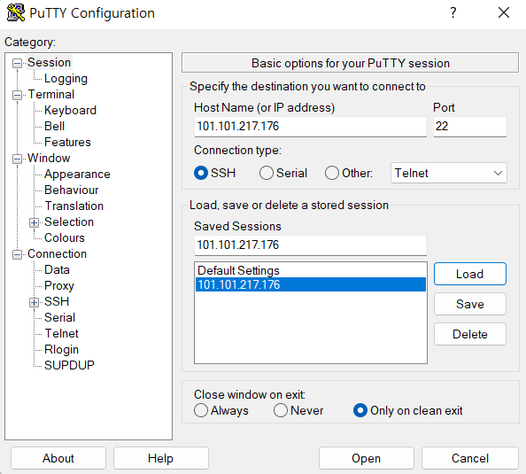

putty를 이용해 할당 받은 서버로 원격 접속한다.<br>

Docker를 설치한다.<br>

```
sudo apt update
sudo apt install apt-transport-https ca-certificates curl software-properties-common
curl -fsSL https://download.docker.com/linux/ubuntu/gpg | sudo apt-key add -
sudo add-apt-repository "deb [arch=amd64] https://download.docker.com/linux/ubuntu bionic stable"
sudo apt install docker-ce
```

[sudo 없이 사용하기](https://subicura.com/2017/01/19/docker-guide-for-beginners-2.html) 해당 링크를 이용하면 sudo를 생략할 수 있다.


```docker login``` : 본인의 계정으로 로그인한다.<br>

```docker pull [DockerHub Respository name]``` : DockerHub에 올려둔 이미지를 pull 받는다.

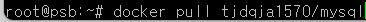


<br>

```docker images``` : 받아온 image들의 목록 출력

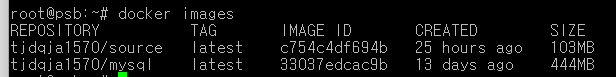

<br>


```docker network create [network 별명]```<br>

```docker volume create [volume 별명]```<br>

```docker run -d  --name [mysql container 별명] -e MYSQL_ROOT_PASSWORD=[root 계정 비밀번호] -p 3306:3306 --network [network id] -v [volume id]:/var/lib/mysql [mysql repository name]``` : mysql container 생성 및 실행<br>

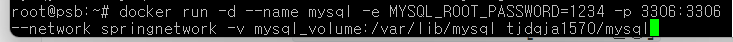

<br>

(+추가)<br>

######  TimeZone 설정 추가

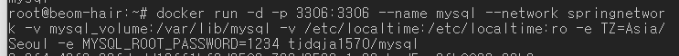

```docker run --name [프로젝트 container 별명] -p 8000:8000 --network [network id] [프로젝트 repository name]``` : 프로젝트 container 생성 및 실행 

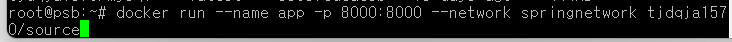


```docker ps -a``` : 컨테이너 목록 확인

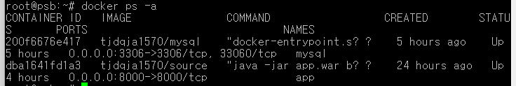

이와 같이 출력된다면 정상 작동하는 것이다.


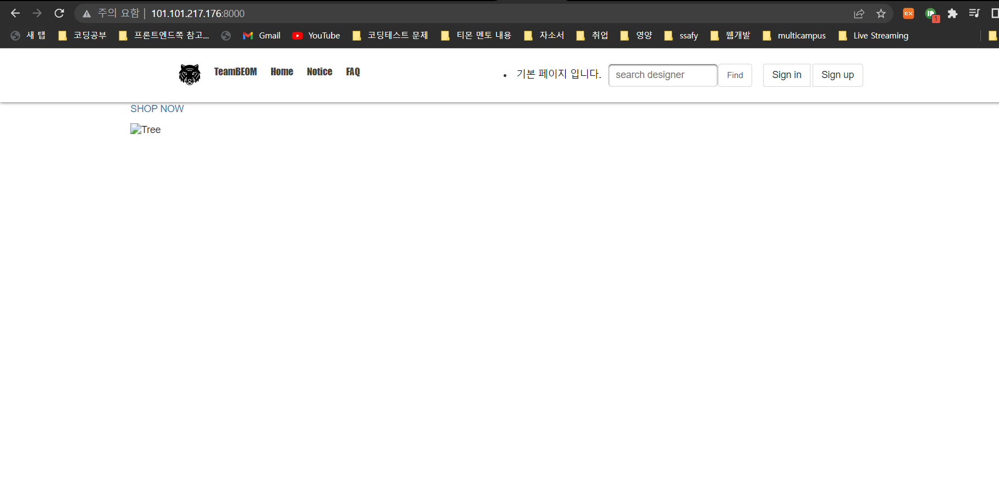


<br><br><br>(+ 추가)

putty에서 mysql 접속해 select문으로 데이터를 출력하는 경우 한글이 "?" 로 출력될 수 있다.


<br>

이때 ```show variables like 'char%';``` 를 이용해 인코딩 상태를 보면 다음과 같다. 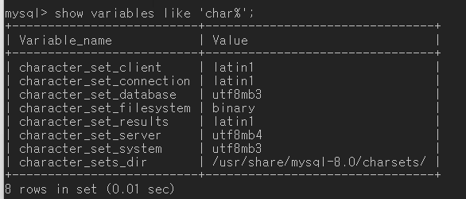

<br>

```set [Variable name] = [value]``` 를 이용해 value 값을 바꿔준다.

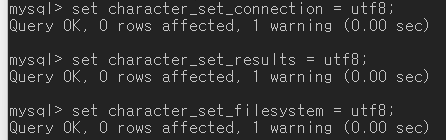


결과 :

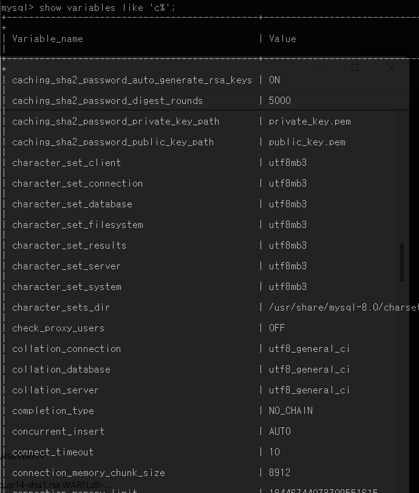


###### 로컬 서버에서 외부 서버로 파일 옮기는 법

```scp C:\default.jpg root@49.50.161.233:/root/deploy/designer```


###### HTTP --> HTTPS 변경

- nginx 컨테이너

```docker run -d -p 80:80 -p  443:443  --name nginx --network springnetwork -v /certbot/conf:/etc/letsencrypt -v /certbot/www:/var/www/certbot  nginx```

위 코드로 nginx 컨테이너를 실행한다.

<br>

- certbot으로 ssl 인증서 받기

```docker run -it --rm --name certbot -v /certbot/conf:/etc/letsencrypt -v /certbot/www:/var/www/certbot --network springnetwork certbot/certbot certonly  -d beomhair.shop --manual --preferred-challenges dns --server https://acme-v02.api.letsencrypt.org/directory```<br>

위 코드를 실행하면 다음과 같은 코드를 얻을 수 있다.

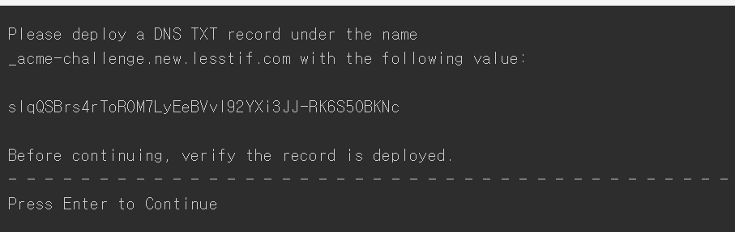


"slqQSBrs4rToROM7LyEeBVvI92YXi3JJ-RK6S5OBKNc" --> 이 부분을 DNS TXT 레코드에 등록한다.

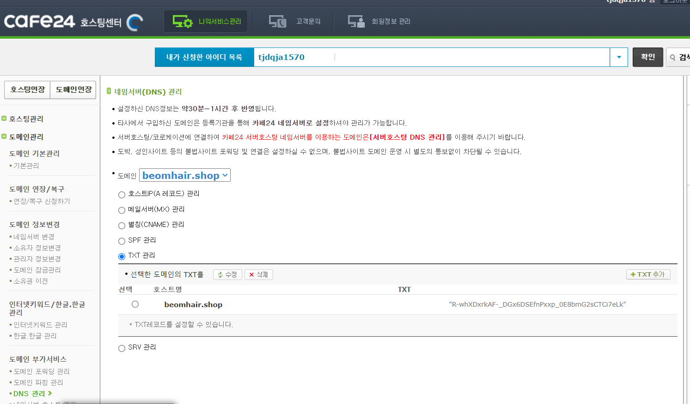

TXT 레코드 등록 후 1분 정도 기다렸다가 Enter를 눌러준다.<br>

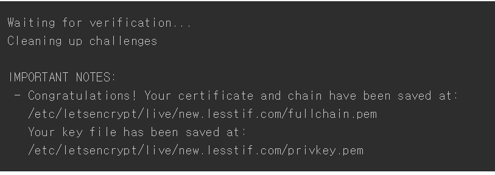

이와 같은 형식의 ssl 인증서를 성공적으로 다운받은 것을 알 수 있다.

``` /etc/letsencrypt/live/{도메인 이름}/fullchain.pem```

```/etc/letsencrypt/live/{도메인 이름}/privkey.pem```

<br><br>


- nginx server 설정 변경

nginx 컨테이너 내부 :

```
docker exec -it nginx bash

apt-get update
apt-get install vim

cd /etc/nginx/conf.d
vim default.conf
```

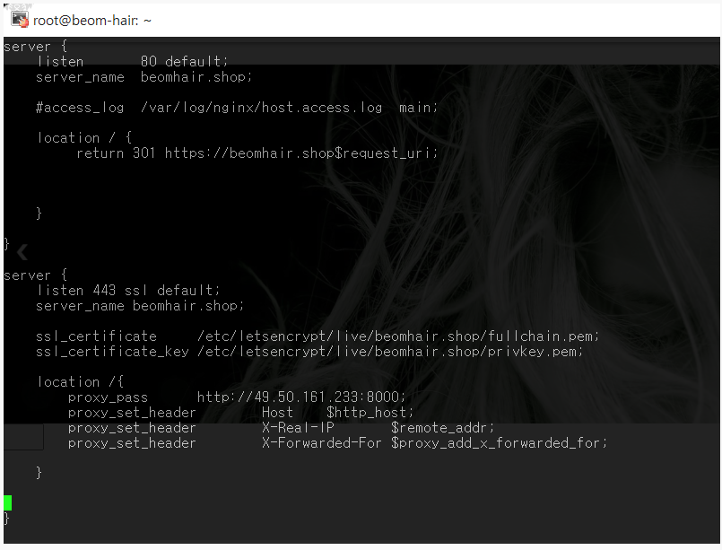

ESC + ":wq" + Enter를 통해 변경 내용을 저장한다.

<br>

```docker restart nginx``` 후에 다음과 같은 결과가 나온다.

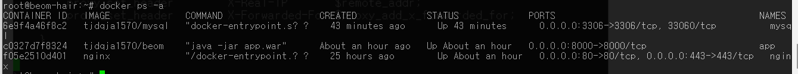

<br>

결과 : 
