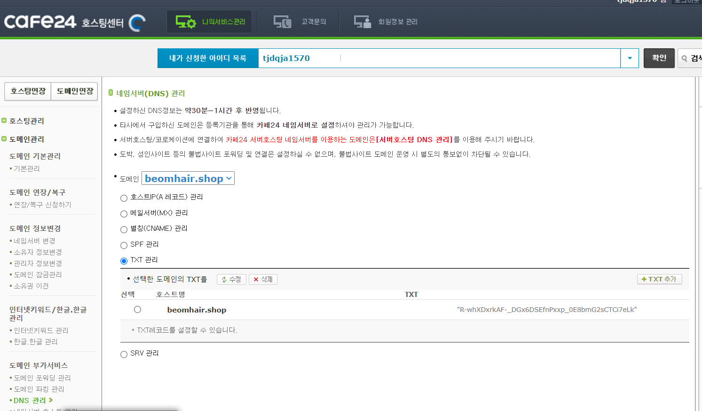
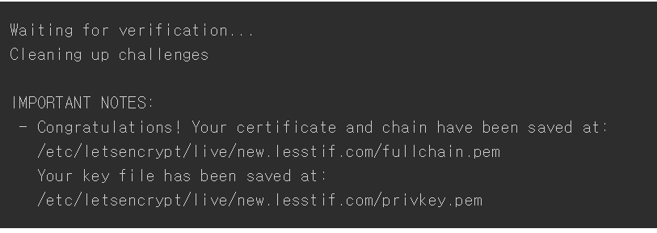
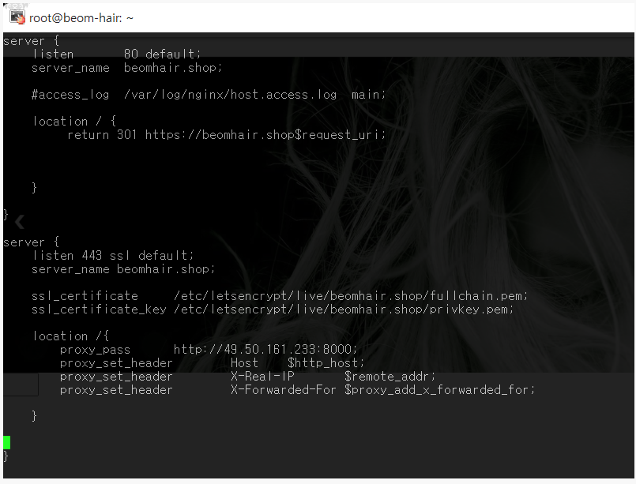
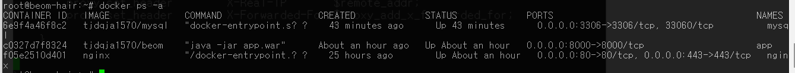

## HTTP --> HTTPS 변경

- nginx 컨테이너

```docker run -d -p 80:80 -p  443:443  --name nginx --network springnetwork -v /certbot/conf:/etc/letsencrypt -v /certbot/www:/var/www/certbot  nginx```

위 코드로 nginx 컨테이너를 실행한다.

<br>

- certbot으로 ssl 인증서 받기

```docker run -it --rm --name certbot -v /certbot/conf:/etc/letsencrypt -v /certbot/www:/var/www/certbot --network springnetwork certbot/certbot certonly  -d beomhair.shop --manual --preferred-challenges dns --server https://acme-v02.api.letsencrypt.org/directory```<br>

위 코드를 실행하면 다음과 같은 결과를 얻을 수 있다.


"slqQSBrs4rToROM7LyEeBVvI92YXi3JJ-RK6S5OBKNc" --> 이 부분을 DNS TXT 레코드에 등록한다.



TXT 레코드 등록 후 1분 정도 기다렸다가 Enter를 눌러준다.<br>



이와 같은 형식의 ssl 인증서를 성공적으로 다운받은 것을 알 수 있다.

``` /etc/letsencrypt/live/{도메인 이름}/fullchain.pem```

```/etc/letsencrypt/live/{도메인 이름}/privkey.pem```

<br><br>


- nginx server 설정 변경

nginx 컨테이너 내부 :

```
docker exec -it nginx bash

apt-get update
apt-get install vim

cd /etc/nginx/conf.d
vim default.conf
```



ESC + ":wq" + Enter를 통해 변경 내용을 저장한다.

<br>

```docker restart nginx``` 후에 다음과 같은 결과가 나온다.



<br>

결과 : 
